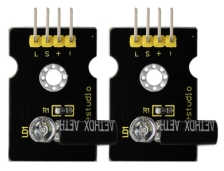
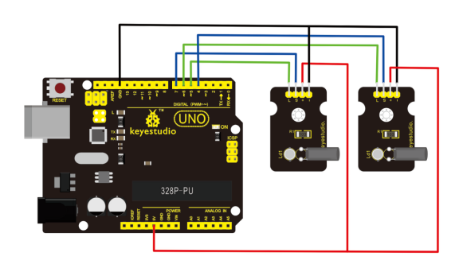
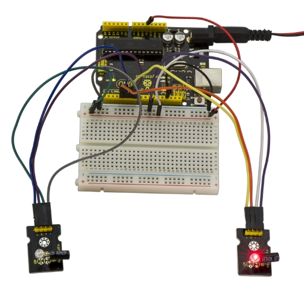
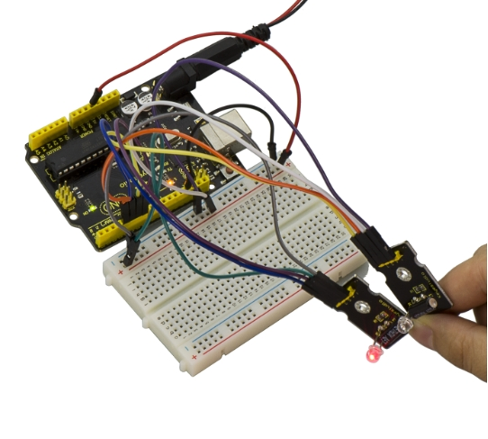

# KS0030 keyestudio Magical Light Cup Module



## 1. Introduction

Keyestudio magic light cup module is able to interact with ARDUINO. The principle is based on the principle of PWM dimming. The brightness of two modules change.

The mercury switch provides a digital signal and trigger PWM regulation, and then you can see the effect like changing two set of cups full of light through the program design.

## 2. Specification

- Supply Voltage: 3.3V to 5V
- Interface: Digital

## 3. Connection Diagram



## 4. Sample Code

Download code : [Code](./Code.7z)

```c
int LedPinA = 5;
int LedPinB = 6;
int ButtonPinA = 7;
int ButtonPinB = 4;
int buttonStateA = 0;
int buttonStateB = 0;
int brightnessA = 0;
int brightnessB= 255;

void setup()
{
    Serial.begin(9600);
    pinMode(LedPinA, OUTPUT);
    pinMode(LedPinB, OUTPUT);
    pinMode(ButtonPinA, INPUT);
    pinMode(ButtonPinB, INPUT);
}

void loop()
{
    buttonStateA = digitalRead(ButtonPinA);
    if (buttonStateA == HIGH && brightnessA != 255)
    {
    	brightnessA ++;
    }
    if (buttonStateA == LOW && brightnessA != 0)
    {
    	brightnessA --;
    }
    analogWrite(LedPinB, brightnessA);
    Serial.print(brightnessA);
    Serial.print("   ");
    buttonStateB = digitalRead(ButtonPinB);
    if (buttonStateB == HIGH && brightnessB != 0)
    {
    	brightnessB --;
    }
    if (buttonStateB == LOW && brightnessB != 255)
    {
    	brightnessB++;
    }
    analogWrite(LedPinA, brightnessB); 
    Serial.println(brightnessB);
    delay(5);
}
```

## 5. Example Result



Wire it up as the above diagram and upload well the code to the board, then you can see one cap lights up while the other one is off. When tilt these two caps towards the same side, one cap is gradually become bright, another bright cap is gradually off.

